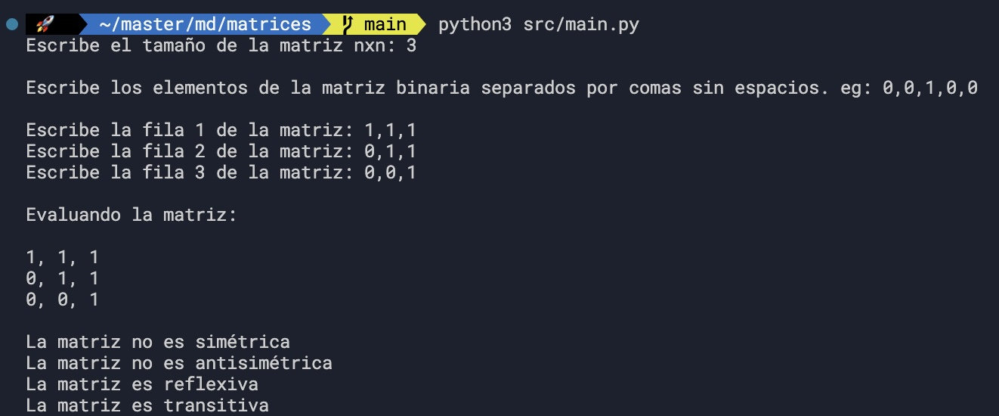

# Binary matrix evaluation
This srcipt evaluates if a matrix relationship has the properties to be:
- Simetric
- Antisimetric
- Reflexive
- Transitive

# Requirements
Pyhon >= 3.9

This program was created using python standar libraries so there is no need to install any external library

# Run the program
This is for Unix like OS:
```python3
python3 src/main.py
```

1. Introduce the size of the matrix as an integer number and hit enter, eg: 3
2. Introduce the values of each row when is prompted and hit enter, eg: 1,1,1

## Notes
- The rows should be comma separated of the same size introduced (since this is a nxn matrix)
- This script uses pure python, no extra libraries are needed

# Example
```python3
python3 src/main.py
```
